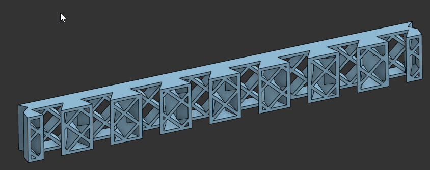
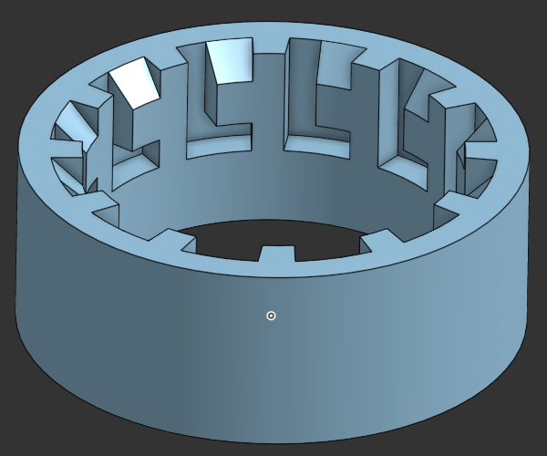
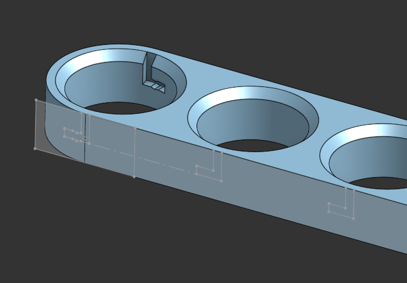
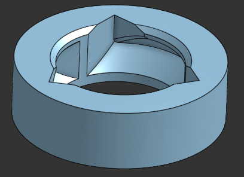
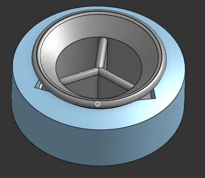
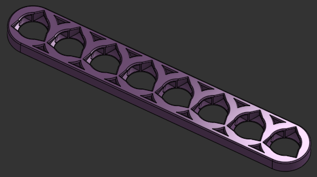

# The Design Process

Originally, I was picturing a dovetail-based system with vertical and horizontal components, but my initial attempts to create this were frustrating and did not match what I had pictured. I was beginning to lose interest in the project when I thought of using a twist-lock mechanism.  
The twist-lock stood out to me because it was sturdy, adaptable, and hadn't been tried before in the context of an organization system. I set out to redesign my system. At first, the new design didn't seem to be working much better than the old one. The main issue was that if I made the keys on the locks big enough to be sturdy, the keyways in the rail would be so large that they wouldn't fit in the 1" by 1" area I had allotted for each hole.  
The idea to make the keys pyramid-shaped started out as an attempt to avoid the need for supports when printing, but as soon as I had the design, I realized that this was the answer to my other problems as well. The pyramid shapes were quite sturdy, didn't take up too much space, and, with a few modifications, made attaching and removing the locks quite easy.  
After this, the design came pretty easily. I have always loved hexagonal patterns, so I knew that I wanted that to be my primary layout, but I also created the linear layout as an alternative. As I began to design attachments, small improvements, such as inserting joints through the back instead of the front, evolved.  
The design process is far from over, but I am at a point where I am comfortable saying that my designs going forward will be backwards-compatible. I look forward to receiving feedback and suggestions from the community.

## Design gallery

