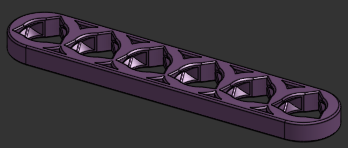

# Gyre manual
  

## Welcome to the world of Gyre!
> In reality, this is less of a complete manual than a compilation of tips and tricks that I have stumbled upon
in the process of designing and testing the system. I intend to continually update it as I learn more, and I
hope to hear from all of you about what you have found that works and what doesn't. There is no single "correct"
way to print or assemble Gyre- whatever works for you is what you should do.
>
> Have fun!

## Contents
[Definitions](#definitions)

[Planning](#planning)

[Printing](#printing)

[Assembling](#assembling)

[Mounting](#mounting)

## Definitions  
||||
|:---:|:---:|:---:|
| Rails | Basic building blocks |  |
| Locks | They lock into rails. Basis of most attachments as well as all joints |  |
| Joints | Made of several locks. They hold multiple rails together. |  | 
| Holes | Holes in the rails where locks are inserted |  | 
| Keys | Pyramid-shaped features on locks that allow them to lock into rails. |  |
| Keyways | Channels in holes that fit keys |  | 

## Planning

>Note: all measurements are in inches unless stated otherwise.

Currently, there are two basic layouts: linear and hex.

I recommend sticking with one of these, especially if you are just starting out with Gyre.
Once you get the "feel" of the system, you will almost certainly think of new ways to use it.
<!-- If you come up with a cool new layout, I would love to hear about it in the [feedback form]() or [thingiverse comments](https://www.thingiverse.com/thing:6913421/comments). -->

In my opinion, the best way to design your layout is as follows:
- Start with a rough idea of what you want
- Print a few parts
- Put them together and hold them up on the wall
- Looking at them, form a guesstimate of how many more pieces you need
- Repeat as necessary

#### IMPORTANT NOTE FOR HEX LAYOUT: A vs B
 
_**In the hex layout, some parts, such as tri/120° joints and the larger drawer attachments
have A and B variants. In these cases, A is used in the lower right, upper right, 
and middle left, while B is used in the upper left, lower left, and middle right. 
It is important to pay attention to this.**_

For those of you that need or want to be somewhat precise in designing your layout, here are some tips and formulas to plan your Gyre layout ahead of time:

#### Linear
Linear layout forms a single horizontal line. Rails can be any length, and they are connected by linear joints.
I recommend using a standard length of rail, but you can mix it up if you want.
To calculate the length of a linear setup, use the following formula (assumes that you are using mounting locks on the ends):
|Variable|Represents|
|:---:|:---:|
|W|total width|
|Lr|length of rail|
|Nr|number of rails|

$$W = ((Lr - 1) * Nr) + (2 * (Nr - 1)) + 1.25$$

For instance, if you are using 8-slot rails, and you have 5 of them, the length will be $$((8-1) * 5) + (2*(5-1)) + 1.25 = 44.25$$ inches long.

#### Hex

There is a little more variability when it comes to hexagonal layouts. You can, of course, make all the sides equal, like this:  
  
However, you may prefer to use different lengths of rails for the horizontal and diagonal sides, like this:  
  
If your imagination is bigger than your print bed, you can even use two or more rails per side, using linear joints.   
The formulas below should work as long as all of the diagonal sides are the same length, and all of the
horizontal sides are the same length. They also assume that you are using 120° joints all around the outside (rather than tri joints).

|Variable|Represents|
|:---:|:---:|
|H|total height|
|W|total width|
|Ld|length of diagonal rails|
|Lv|length of vertical rails|
|Nd|number of diagonal rails|
|Nh|number of horizontal rails|
<!-- > Note- Nd and Nh refer to the number of rails in a given row or column. 
For instance, in the layout below, Nh = 3 (purple) and Nw = 3 (green) -->
>

$$W = ((Lh + 1) * Nh) + (0.5 * (Ld + 1) * (Nh + 1)) + 0.95$$

$$H = ((Ld + 1) * Nd * 0.87) + 1.25$$ 
 

In this example, the number of diagonal rails (purple) is 3, and the length of the diagonal rails is 6. The number of horizontal rails (green) is 3 and the length of the horizontal rails is 8. Therefore:
$$W = ((8 + 1) * 3) + (0.5 * (6 + 1) * (3 + 1)) + 0.95 = 41.95"$$
$$H = ((6 + 1) * 3 * 0.87) + 1.25 = 19.52"$$

## Printing

There is nothing special about printing Gyre parts- default settings should be just fine most of the time.

Print settings for Gyre attachments may vary. These are beyond the scope of this tipsheet. 
For more info, check out the thingiverse page for the attachment you are printing.

A few notes for printing parts in the core framework:
- I have only printed them in PLA, so I don't know how well other materials work. 
Feel free to experiment with other materials. I'd love to hear what your results are.
- No supports should be needed, as long as the prints are oriented correctly, and your printer can manage a 45° overhang. 
- Brims are a pain to remove, so only use them if you're having adhesion issues.
- Always use common sense!

## Assembling
### Orientation
Rail orientation: The holes are triangular (sort of). This "triangle" should always be upright, not upside down or sideways. Examples:  
 
 
 

Lock and joint orientation: The keys also form a triangular shape. When inserting a lock or joint into a rail, the triangle should be upright to match the hole, but once it is locked in place, it should be upside down. Examples:  

### The assembly process
> For linear layout, follow the first four steps below, but with a linear joint instead of a triple joint. Repeat as necessary. 
- Orient a joint A and a rail as shown  
  
- Rotate the joint 60° counterclockwise  
 
- Insert joint into rail  
  
- Rotate the joint back to its original position  
  
- Repeat the process until you have the following pieces:
    - joint A + rail + joint B + rail + joint A
    - joint B + rail + joint A + rail + joint B
    - 2x extra rails  
  
- Lay out the pieces as shown:  
  
- Slide the extra rails onto the joints, as shown:  
  
- Rotate the whole thing so that it becomes a hexagon  
 
- Repeat as necessary, adding on to what has already been built, until it is as large as you want it   
  

## Mounting
All joints have holes in the center to accommodate screws. They are designed for basic wood screws with flat heads, but most types of screws will work fine.  
Additionally, there is a special type of lock called a mounting lock that has a screw hole and is the right size for mounting. It can be helpful at the ends of linear layouts, or any place where the end of a rail is just "hanging out in space."

How many mounting point you use is up to your discretion. I would recommend starting with fewer, then CAUTIOUSLY testing the setup, and adding more as needed.

It is possible to plan your layout such that all mounting points fall on the studs in your wall, but it is rather difficult. Instead, I recommend that you use some type of drywall anchor. Driving screws directly into the drywall will NOT provide enough support.
